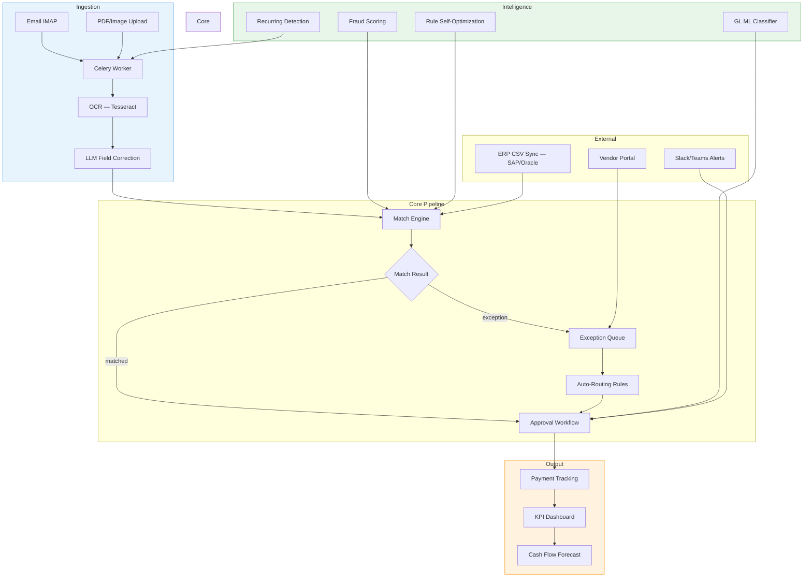

# AI AP Operations Manager

> AI-native Accounts Payable automation for manufacturing and supply chain enterprises.

[](LICENSE)
[](https://www.python.org/)
[](https://fastapi.tiangolo.com/)
[](https://nextjs.org/)
[](https://docs.docker.com/compose/)

---

## What It Does

End-to-end AP automation: **invoice ingestion → OCR extraction → 2/3/4-way matching → exception handling → approval workflows → payment tracking → KPI reporting.**

**Core principle**: A deterministic rule engine owns all business decisions. The LLM is used only for structuring tasks (OCR correction, policy parsing, root-cause narration) — never for final approve/reject decisions. Every decision is auditable and traceable to a specific rule version.

---

## Quick Start

```bash
git clone https://github.com/your-username/ai-ap-manager.git
cd ai-ap-manager
make demo
```

That's it. The script will:
1. Copy `.env.example` → `.env` (LLM defaults to `claude_code` — free, no API key needed)
2. Start all Docker services
3. Run database migrations
4. Load seed data (vendors, POs, invoices, users)
5. Print access URLs and demo credentials

| Service | URL |
|---------|-----|
| Dashboard | http://localhost:3000 |
| API Docs (Swagger) | http://localhost:8002/docs |
| MinIO Console | http://localhost:9001 |

**Demo accounts** (password: `changeme123`):

| Role | Email |
|------|-------|
| Admin | admin@example.com |
| AP Analyst | analyst@example.com |
| Approver | approver@example.com |
| AP Clerk | clerk@example.com |

---

## Architecture



```
┌─────────────────────────────────────────────────────────────┐
│                       Tech Stack                            │
├──────────────┬──────────────────────────────────────────────┤
│ Frontend     │ Next.js 14, TypeScript, shadcn/ui, Recharts  │
│ Backend      │ FastAPI, SQLAlchemy 2.0, Alembic, Pydantic   │
│ Database     │ PostgreSQL 16                                 │
│ Queue        │ Celery + Redis 7                              │
│ Storage      │ MinIO (S3-compatible)                         │
│ OCR          │ Tesseract (local) / Google Vision (prod)      │
│ AI/LLM       │ Claude claude-sonnet-4-6 via Anthropic API          │
│ ML           │ scikit-learn — TF-IDF + Logistic Regression   │
│ Infra        │ Docker Compose (dev) / Nginx + Gunicorn (prod)│
└──────────────┴──────────────────────────────────────────────┘
```

---

## Feature Map

### Ingestion & Extraction
- Email IMAP polling (monitors AP mailbox, extracts attachments)
- PDF/image upload via UI or API
- Tesseract OCR + LLM field correction
- Recurring invoice detection (auto-tags known patterns)
- Duplicate invoice detection

### Matching Engine
- **2-way match**: Invoice vs Purchase Order (amount + quantity tolerance)
- **3-way match**: + Goods Receipt Note (partial receipt, multi-GRN aggregation)
- **4-way match**: + Inspection Report (quality-inspection workflows)
- Per-vendor / per-category / per-currency tolerance overrides
- Multi-currency with daily ECB FX rates

### Exception Handling
- Typed exception taxonomy: `PRICE_OVER_TOLERANCE`, `QTY_OVER_RECEIPT`, `GRN_NOT_FOUND`, `DUPLICATE`, `FRAUD_SUSPECT`, etc.
- Auto-routing rules (assign exceptions to teams/users by type/vendor/amount)
- Exception comment threads (vendor communication hub)
- Vendor portal for status check, disputes, and invoice submissions

### Approval Workflow
- Multi-level approval matrix (configurable by amount tier and department)
- Email-token approvals (HMAC-signed, one-click approve/reject from email)
- Approval escalation (beat task, configurable SLA)
- Slack/Teams webhook notifications

### Intelligence Layer
- **GL ML Classifier**: TF-IDF + Logistic Regression, weekly auto-retrain, accuracy visible in admin
- **Fraud Scoring**: Rule-based (duplicate vendor/bank, round-amount flags, velocity checks)
- **Rule Self-Optimization**: System surfaces rule change recommendations from override history
- **Root Cause Analysis**: LLM-generated narrative when exception rate spikes
- **Policy Parsing**: Upload a policy/contract PDF → LLM extracts matching rules → human reviews → published

### Analytics & KPI
- KPI dashboard: touchless rate, cycle time, exception rate, GL accuracy, fraud catch rate
- Industry benchmarks comparison (Tipalti, Medius, Coupa)
- Cash flow forecast (payment schedule + due date analysis)
- Audit trail export (CSV) with full decision replay

### Admin & Operations
- RBAC: `AP_CLERK`, `AP_ANALYST`, `APPROVER`, `ADMIN`, `AUDITOR`
- Multi-entity support (subsidiaries with entity selector in sidebar)
- ERP CSV sync: SAP PO import, Oracle GRN import
- GDPR data retention automation (monthly Celery beat)
- Vendor risk scoring (weekly, auto-flags high-risk vendors)
- User notification preferences (email / Slack / Teams per event type)
- In-app notification center (30s polling)

---

## LLM Configuration

Four backends, switchable via `.env` — no code changes needed:

| Provider | Setup | Cost | Notes |
|----------|-------|------|-------|
| `claude_code` | Claude Code CLI installed | **Free** | Default for local dev |
| `anthropic` | `ANTHROPIC_API_KEY` in `.env` | Pay-per-token | Required for Ask AI feature |
| `ollama` | Ollama running locally | Free | Privacy-first self-hosting |
| `none` | Nothing | Free | Disables AI, manual review only |

Per-use-case overrides: set `LLM_PROVIDER_EXTRACTION`, `LLM_PROVIDER_POLICY`, `LLM_PROVIDER_ANALYTICS`, `LLM_PROVIDER_ASK_AI` independently in `.env`.

---

## Project Structure

```
ai-ap-manager/
├── frontend/               # Next.js 14 (App Router)
│   ├── src/app/            # Pages: dashboard, invoices, exceptions, approvals, admin, portal
│   ├── src/components/     # UI components (shadcn/ui based)
│   └── src/lib/            # Axios API client, React Query hooks, Zustand stores
├── backend/
│   ├── app/
│   │   ├── api/v1/         # REST endpoints (invoices, exceptions, approvals, kpi, admin...)
│   │   ├── core/           # Config, security, dependencies
│   │   ├── db/             # Database session management
│   │   ├── middleware/     # Request/response middleware
│   │   ├── models/         # SQLAlchemy ORM models
│   │   ├── schemas/        # Pydantic request/response schemas
│   │   ├── services/       # Business logic (approval, fraud, GL coding, notifications...)
│   │   ├── rules/          # Deterministic match engine (2/3/4-way)
│   │   ├── ai/             # LLM abstraction layer (4 providers)
│   │   ├── integrations/   # ERP CSV imports (SAP, Oracle)
│   │   └── workers/        # Celery tasks + beat schedule
│   ├── alembic/            # Database migrations
│   ├── tests/              # Test suite
│   └── scripts/            # Database seeding scripts
├── docs/                   # Architecture, PRD, API, rules engine, security docs
├── scripts/
│   ├── seed.py             # Idempotent demo data seeder
│   └── demo.sh             # One-command quickstart (called by make demo)
├── nginx/                  # Production reverse proxy config
├── docker-compose.yml      # Local development stack
├── docker-compose.prod.yml # Production stack (Nginx + Gunicorn)
└── Makefile                # Dev workflow shortcuts
```

---

## Development

```bash
make up              # Start all Docker services
make migrate         # Run Alembic migrations
make seed            # Load demo data (idempotent)
make logs            # Tail backend + worker logs
make test            # Run backend tests
make test-coverage   # Tests with HTML coverage report
make lint            # ruff + mypy

# Generate a new migration
make migrate-gen MSG="add vendor risk table"
```

**Running without Docker (backend only)**:
```bash
cd backend
python -m venv .venv && source .venv/bin/activate
pip install -r requirements.txt
uvicorn app.main:app --reload --port 8002
```

**Port reference**:

| Service | Host Port |
|---------|-----------|
| Frontend | 3000 |
| Backend API | 8002 |
| PostgreSQL | 5433 |
| Redis | 6380 |
| MinIO API | 9000 |
| MinIO Console | 9001 |

---

## Production Deployment

A production-ready `docker compose.prod.yml` with Nginx reverse proxy and Gunicorn (120s timeout for LLM calls) is included:

```bash
cp .env.example .env.prod
# Edit: set ANTHROPIC_API_KEY, strong JWT_SECRET, production DB creds

docker compose -f docker compose.prod.yml up -d
```

---

## Documentation

| Doc | Description |
|-----|-------------|
| [GOALS.md](GOALS.md) | Vision, milestones, north star metrics vs industry benchmarks |
| [TODO.md](TODO.md) | Full task backlog (P0/P1/P2/P3) |
| [docs/ARCHITECTURE.md](docs/ARCHITECTURE.md) | System architecture, data flow, module map |
| [docs/PRD.md](docs/PRD.md) | Product requirements and user journeys |
| [docs/DATABASE.md](docs/DATABASE.md) | ERD and all table schemas |
| [docs/API.md](docs/API.md) | REST API endpoint reference |
| [docs/RULES_ENGINE.md](docs/RULES_ENGINE.md) | Match engine design, tolerance config, exception taxonomy |
| [docs/AI_MODULES.md](docs/AI_MODULES.md) | LLM integration design and safety guardrails |
| [docs/SECURITY.md](docs/SECURITY.md) | RBAC, authentication, audit, data protection |
| [docs/GAP_ANALYSIS.md](docs/GAP_ANALYSIS.md) | Feature completion audit |

---

## Implementation Status

| Phase | Status |
|-------|--------|
| **MVP (P0)** — Invoice upload → OCR → 2-way match → exception queue → approval → KPI | ✅ |
| **V1 (P1)** — 3-way match, email IMAP, multi-level approval, recurring detection, vendor portal | ✅ |
| **V2 (P2)** — ERP CSV sync, FX rates, GL ML classifier, 4-way match, multi-entity | ✅ |
| **P3 (selected)** — Slack/Teams, vendor risk scoring, GDPR retention, notification center | ✅ |

Remaining roadmap (explicitly deferred): PWA service worker, WebSocket push, live ERP API connectors (BAPI/REST), Playwright E2E tests, Prometheus metrics.

---

## Contributing

PRs welcome. Please open an issue first for major changes.

```bash
make test   # Run tests before submitting
make lint   # Check linting
```

---

## License

[MIT](LICENSE)
